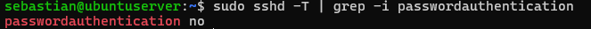

# Hito 1: Hardening Estricto del Servicio SSH

## 🎯 Objetivo
Eliminar la superficie de ataque por fuerza bruta sobre el servicio SSH en el servidor Ubuntu (`192.168.233.140`), restringiendo el acceso exclusivamente a clientes autorizados mediante llaves criptográficas asimétricas (Ed25519) y aplicando la política de mínimo privilegio.

---

## 🔑 1. Aprovisionamiento de Claves Criptográficas
Se generaron pares de claves SSH utilizando el algoritmo moderno **Ed25519** en los clientes autorizados (Windows PowerShell y Ubuntu Client) y se exportaron las claves públicas hacia el servidor.

* **Comando de generación (Cliente):**
  ```powershell
  ssh-keygen -t ed25519 -C "admin-homelab"
  ```
* **Comando de despliegue de clave pública desde PowerShell:**
  ```powershell
  Get-Content C:\Users\sebas\.ssh\id_ed25519.pub | ssh sebastian@192.168.233.140 "mkdir -p ~/.ssh && cat >> ~/.ssh/authorized_keys"
  ```
* **Verificación de permisos en el servidor:**
  ```bash
  chmod 700 ~/.ssh
  chmod 600 ~/.ssh/authorized_keys
  ```

---

## ⚙️ 2. Modificaciones de Seguridad en `/etc/ssh/sshd_config`
Se editaron las directivas principales en la configuración del demonio SSH (`sshd`):

| Directiva | Valor Aplicado | Justificación de Ciberseguridad |
| :--- | :--- | :--- |
| `PubkeyAuthentication` | `yes` | Habilita la autenticación mediante par de llaves pública/privada. |
| `PasswordAuthentication` | `no` | **Inhabilita el acceso por contraseña**, mitigando ataques de diccionario y fuerza bruta. |
| `PermitRootLogin` | `no` | Impide el inicio de sesión directo como `root`, forzando el uso de cuentas de usuario estándar y `sudo`. |
| `PermitEmptyPasswords` | `no` | Deniega el acceso a cuentas que no tengan contraseña configurada. |

**Reinicio del servicio:**
```bash
sudo systemctl reload ssh
```

---

## 🔎 3. Verificación de la Configuración Efectiva en Tiempo de Ejecución (Runtime)
En entornos modernos como Ubuntu Server, la directiva `Include /etc/ssh/sshd_config.d/*.conf` en `/etc/ssh/sshd_config` puede hacer que archivos secundarios (como los creados por `cloud-init` u otros instaladores) sobrescriban los parámetros principales.

Para validar la **configuración efectiva real** procesada por el demonio OpenSSH en tiempo de ejecución, se ejecutó la siguiente evaluación de estado:

```bash
sudo sshd -T | grep -i passwordauthentication
```

* **Salida obtenida:**
  ```text
  passwordauthentication no
  ```

> **Lección de Auditoría:** Validar `/etc/ssh/sshd_config` estáticamente no garantiza el comportamiento final del servicio. Evaluar el estado en tiempo de ejecución con `sshd -T` es el estándar técnico para confirmar que no existen archivos en `sshd_config.d/` alterando las directivas de hardening.

---

## 🧪 4. Prueba de Estrés y Simulación de Ataque
Para validar que el servicio rechaza activamente las conexiones no autenticadas por clave criptográfica, se forzó un intento de autenticación por contraseña omitiendo el uso de llaves públicas desde el cliente:

```powershell
# Intento deliberado de forzar autenticación por contraseña omitiendo las llaves
ssh -o PubkeyAuthentication=no sebastian@192.168.233.140
```

* **Resultado obtenido:** `Permission denied (publickey)`.
* **Conclusión:** El servidor rechaza cualquier solicitud que no presente una firma criptográfica válida en `authorized_keys`.

---
