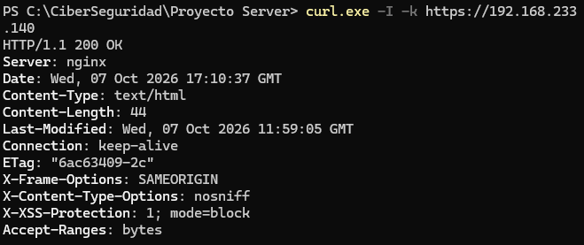

# Hito 03: Servidor Web Nginx con TLS/SSL y Cabeceras de Seguridad

## 🎯 Objetivo
Desplegar un servidor web Nginx seguro en Ubuntu Server (`192.168.233.140`), configurando cifrado de transporte mediante certificados TLS/SSL, redirección automática HTTP a HTTPS y cabeceras de seguridad HTTP (*HTTP Security Headers*) alineadas con estándares modernos.

---

## 📁 1. Estructura del Sitio Web
Se creó el directorio raíz del sitio en la ruta estándar del sistema `/var/www/homelab/html` con permisos restringidos:

```bash
sudo mkdir -p /var/www/homelab/html
sudo chown -R $USER:$USER /var/www/homelab/html
sudo chmod -R 755 /var/www/homelab
```

Se desplegó un archivo `index.html` personalizado con la identidad del laboratorio.

---

## 🔐 2. Generación de Certificado TLS/SSL con SAN (Subject Alternative Name)
Se generó un par de claves y certificado X.509 autofirmado utilizando OpenSSL, incluyendo la extensión SAN para evitar advertencias de validación estricta de nombres en navegadores modernos:

```bash
sudo mkdir -p /etc/ssl/homelab

sudo openssl req -x509 -nodes -days 365 -newkey rsa:2048 \
  -keyout /etc/ssl/homelab/nginx-selfsigned.key \
  -out /etc/ssl/homelab/nginx-selfsigned.crt \
  -subj "/CN=192.168.233.140/O=Homelab Cybersecurity/C=ES" \
  -addext "subjectAltName=IP:192.168.233.140"
```

---

## ⚙️ 3. Configuración del Virtual Host en Nginx (`/etc/nginx/sites-available/homelab`)

Se configuró el bloque de servidor implementando redirección 301 forzada a HTTPS y cabeceras de protección defensivas con la cláusula `always;` para asegurar su envío en todos los códigos de respuesta HTTP:

```nginx
# Bloque HTTP - Redirección 301 a HTTPS
server {
    listen 80;
    listen [::]:80;
    server_name 192.168.233.140;

    return 301 https://$host$request_uri;
}

# Bloque HTTPS - Servidor Seguro
server {
    listen 443 ssl http2;
    listen [::]:443 ssl http2;
    server_name 192.168.233.140;

    root /var/www/homelab/html;
    index index.html;

    # Certificados TLS/SSL
    ssl_certificate /etc/ssl/homelab/nginx-selfsigned.crt;
    ssl_certificate_key /etc/ssl/homelab/nginx-selfsigned.key;
    ssl_protocols TLSv1.2 TLSv1.3;
    ssl_ciphers HIGH:!aNULL:!MD5;

    # Cabeceras de Seguridad HTTP (Security Headers)
    add_header Strict-Transport-Security "max-age=31536000; includeSubDomains" always;
    add_header X-Content-Type-Options "nosniff" always;
    add_header X-Frame-Options "DENY" always;
    add_header Content-Security-Policy "default-src 'self';" always;
    add_header Referrer-Policy "no-referrer-when-downgrade" always;

    location / {
        try_files $uri $uri/ =404;
    }
}
```

**Validación y activación del sitio:**
```bash
sudo ln -s /etc/nginx/sites-available/homelab /etc/nginx/sites-enabled/
sudo rm /etc/nginx/sites-enabled/default
sudo nginx -t
sudo systemctl reload nginx
```

---

## 🧪 4. Verificación de Seguridad y Respuesta HTTP

Se verificó la respuesta del servidor web mediante `curl` evaluando las cabeceras emitidas:

```bash
curl -I -k https://192.168.233.140
```

### Output Obtenido:



* **Redirección 301:** Comprobada solicitando `http://192.168.233.140` (devuelve `Location: https://192.168.233.140/`).
* **Verificación de Cabeceras:** `X-Frame-Options: DENY` previene ataques de Clickjacking; `X-Content-Type-Options: nosniff` mitiga MIME-sniffing; `Strict-Transport-Security` fuerza conexiones HTTPS futuras.
