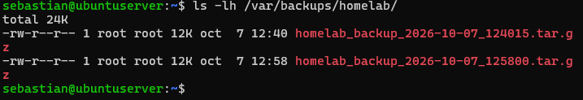

# Hito 05: Script de Respaldos Automatizados y Prueba de Restauración

## 🎯 Objetivo
Garantizar la recuperabilidad del sistema mediante la automatización de copias de seguridad periódicas de los archivos de configuración críticos (`SSH`, `Nginx`, `UFW`, `Fail2ban`, Certificados TLS/SSL) y el contenido web, aplicando una política de retención automática a 7 días e implementando una prueba de restauración (*Restore Drill*).

---

## 📜 1. Script de Respaldo en Bash (`/usr/local/bin/backup-homelab.sh`)

Se diseñó un script en Bash que empaqueta las configuraciones y datos esenciales en un archivo comprimido `.tar.gz` con marca de tiempo y registra la ejecución en un archivo de log dedicado.

```bash
#!/bin/bash

# ===========================================================================>
# Script de Respaldo Automatizado - Homelab Cybersecurity
# ===========================================================================>

# Directorio donde se almacenarán los backups
BACKUP_DIR="/var/backups/homelab"

# Fecha y hora para identificar cada backup
DATE=$(date +%Y-%m-%d_%H%M%S)

# Nombre completo del archivo de backup
BACKUP_FILE="$BACKUP_DIR/homelab_backup_$DATE.tar.gz"

# Archivo de registro
LOG_FILE="/var/log/homelab_backup.log"


# ===========================================================================>
# CREAR DIRECTORIO DE BACKUPS
# ===========================================================================>

# Asegurar que el directorio de respaldos existe
mkdir -p "$BACKUP_DIR"

echo "[$(date)] Starting Homelab Backup Process..." >> "$LOG_FILE"


# ===========================================================================>
# CREAR BACKUP
# ===========================================================================>

# Comprimir los archivos de configuración y el sitio web
tar -czf "$BACKUP_FILE" \
    /etc/ssh/sshd_config \
    /etc/nginx/sites-available \
    /etc/fail2ban/jail.local \
    /var/www/homelab \
    2>> "$LOG_FILE"


# ===========================================================================>
# COMPROBAR RESULTADO
# ===========================================================================>

if [ $? -eq 0 ]; then

    echo "[$(date)] SUCCESS: Backup created at $BACKUP_FILE" >> "$LOG_FILE"


    # =======================================================================>
    # ROTACIÓN DE BACKUPS
    # =======================================================================>

    # Eliminar backups de más de 7 días
    find "$BACKUP_DIR" \
        -type f \
        -name "homelab_backup_*.tar.gz" \
        -mtime +7 \
        -delete \
        2>> "$LOG_FILE"

    echo "[$(date)] Retention policy applied (removed backups older than 7 da>
        >> "$LOG_FILE"

else

    echo "[$(date)] ERROR: Backup failed!" >> "$LOG_FILE"

fi
```

**Asignación de permisos:**
```bash
sudo chmod +x /usr/local/bin/backup-homelab.sh
```

---

## ⏰ 2. Programación con Crontab
Para ejecutar el respaldo automáticamente todas las noches a las **02:00 AM**, se registró la tarea en el crontab del usuario `root`:

```bash
sudo crontab -e
```

**Línea registrada:**
```cron
0 2 * * * /usr/local/bin/backup-homelab.sh
```

---

## 🧪 3. Verificación de Ejecución y Log

### A. Ejecución Manual y Contenido del Directorio
```bash
sudo /usr/local/bin/backup-homelab.sh
ls -lh /var/backups/homelab/
```



### B. Registro de Auditoría (`/var/log/homelab_backup.log`)
```text
[mié 07 oct 2026 12:40:15 UTC] Starting Homelab Backup Process...
[mié 07 oct 2026 12:40:15 UTC] SUCCESS: Backup created at /var/backups/homelab/homelab_backup_2026-10-07_124015.tar.gz
[mié 07 oct 2026 12:40:15 UTC] Retention policy applied (removed backups older than 7 days).
```

---

## 🔄 4. Prueba de Restauración (Restore Drill)
Un respaldo no verificado no garantiza la continuidad. Se realizó un simulacro de recuperación extrayendo el contenido del archivo en un directorio temporal aislado (`/tmp/restore_test`):

```bash
# 1. Crear directorio aislado para prueba de restauración
mkdir -p /tmp/restore_test

# 2. Descomprimir el respaldo en el directorio temporal
sudo tar -xzf /var/backups/homelab/homelab_backup_2026-10-07_124015.tar.gz -C /tmp/restore_test

# 3. Verificar la integridad de los archivos recuperados
ls -la /tmp/restore_test/etc/ssh/
ls -la /tmp/restore_test/var/www/homelab/html/
```

* **Resultado:** Todos los archivos de configuración y la web `index.html` mantuvieron su estructura, permisos y contenido íntegro.
* **Limpieza tras la prueba:** `sudo rm -rf /tmp/restore_test`.

---

## 💡 5. Evaluación de Riesgos de la Estrategia
* **Limitación Identificada:** Guardar copias de seguridad exclusivamente en el almacenamiento local de la propia máquina virtual implica un punto único de fallo (*Single Point of Failure*). En caso de corrupción completa de disco o destrucción de la VM, los respaldos se perderían.
* **Mejora Futura Propuesta:** Replicar el archivo `.tar.gz` generado hacia un servidor remoto secundario o almacenamiento en la nube mediante un trabajo seguro con `rsync` sobre SSH (`scp`).
